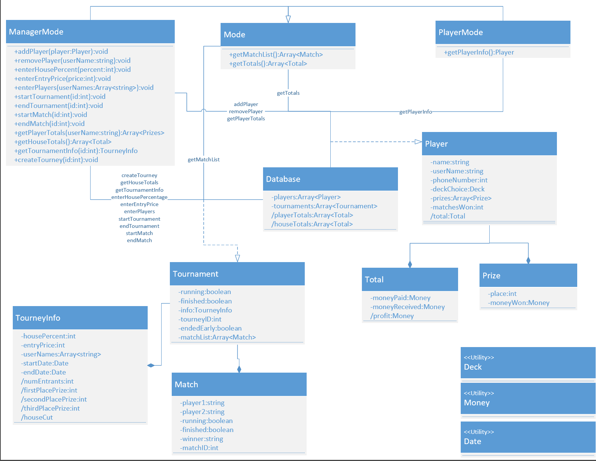
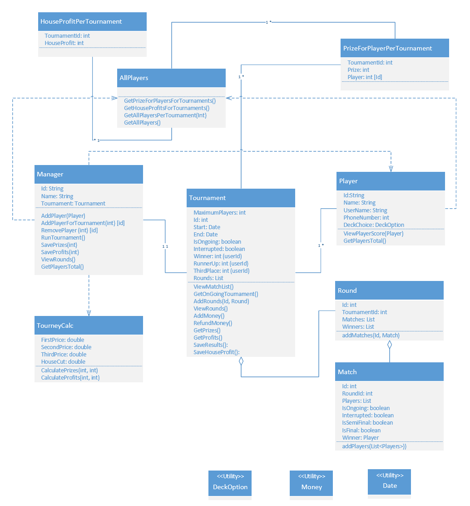
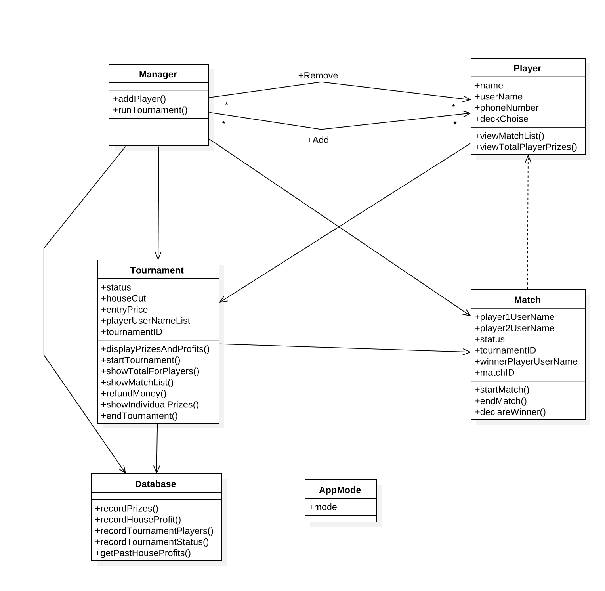
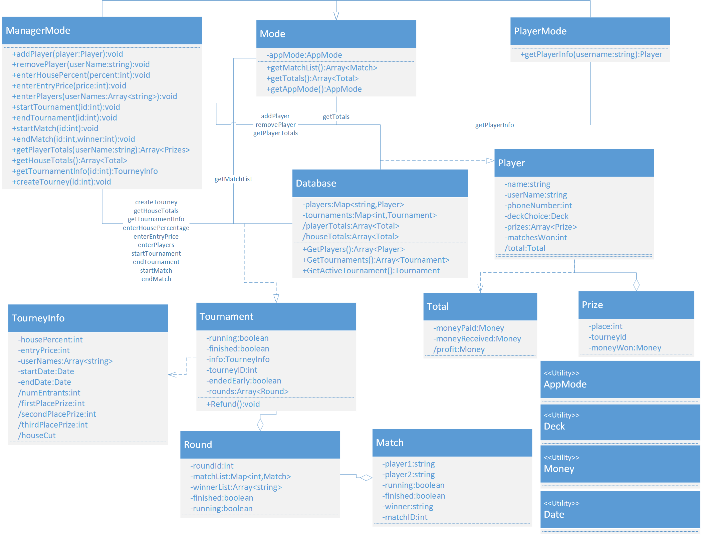

Individual Designs
=====================

Design 1 - Joseph M. Honea
--------------------------------------

####**Pros:**
    The design covers all the requirements.
    ManagerMode class gives the flexibility required to run the tournament in Manager mode.
    Design has the Utility classes for requirements such Date, Deck and Money. 
####**Cons:**
	Not easy to keep track of matches classes from the Tournament class.

Design 2 - Indika Pathirage
--------------------------------------

####**Pros:**
	Design has the Utility classes for requirements such Date, Deck and Money. 
	Round class makes it easier to manage and track the rounds of matches.
	

####**Cons:**
	The design covers all the requirements.
	No centralized database class to manage the db calls.
	There is no player mode class. Tracking of the Manager mode vs Player mode becomes difficult.

Design 3 - Rajendra Ugrani
----------------------------------

####**Pros:**
	The design covers all the requirements
	App mode utility class being a global variable, help track the App mode better.

####**Cons:**
	There is no player mode class. Tracking of the Manager mode vs Player mode becomes difficult.
	Design does not mention all the Utility classes requires such as Money, Date etc.
	
	
Team Design
=====================

Commonalities:
--------------------------------------
	All the individual designs addressed the requirements adequately, with some difference in efficiency, scalability and maintainability.
	The Match, Tournament, Player and Manager class were common between the individual designs.
	Individual designs differed on what is the central class for the whole design.

Justification:
--------------------------------------
	All the decision we took on the final design were stemmed from certain design principles such as scalability, maintainability and efficiency.
	We decided to have a centralized database class for easier maintainence and query of data.
	We decided to borrow the Round class from one of the individual design for better tracking of Rounds of matches.
	AppMode member added to the Mode class to discern between the two subclasses.
	We borrowed ManagerMode class for better managing mode of the app.
	We added prizes attribute in the player class for easy access to the prizes.

Summary
=====================
	The final design that we came up with tried to borrow the best features from each individual design.
	The team deliberation and discussion helped clear the doubts we had on UML relationships and other design questions.
	The discussion also helped us understand the dependency injection in between classes.
	The group discussion gives more clarity to the requirements and design.
	Discussions revealed the group members think fairly similarly.
	We also tried to create a design which could be easily modified for future requirements, without having to impact the other classes much.
	The biggest lesson learnt is, design reviews and peer reviews are very very important and it helps address the design gaps. We would like to take this lesson to implementation phase.