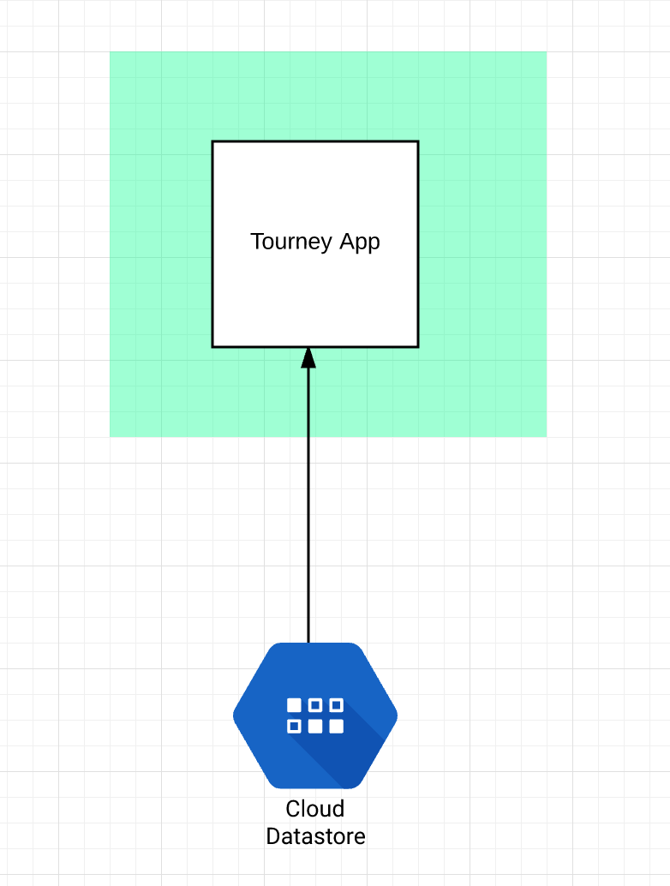
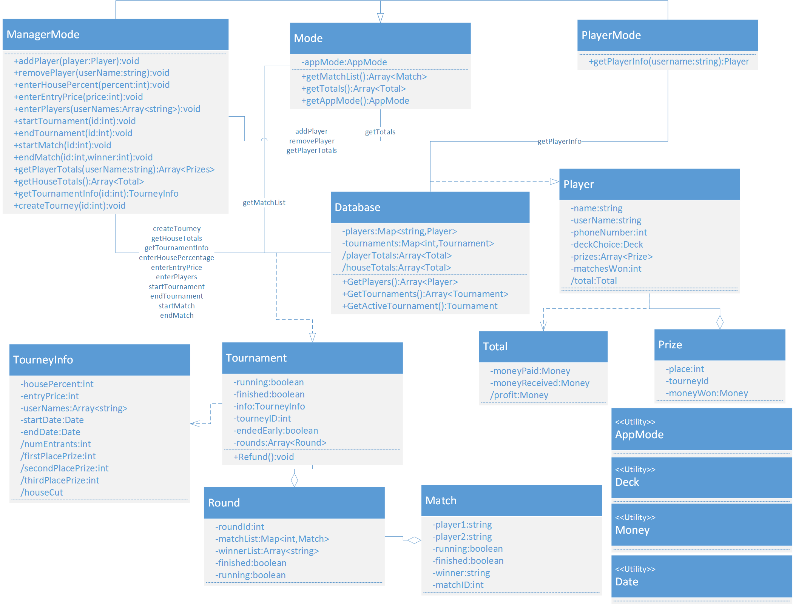
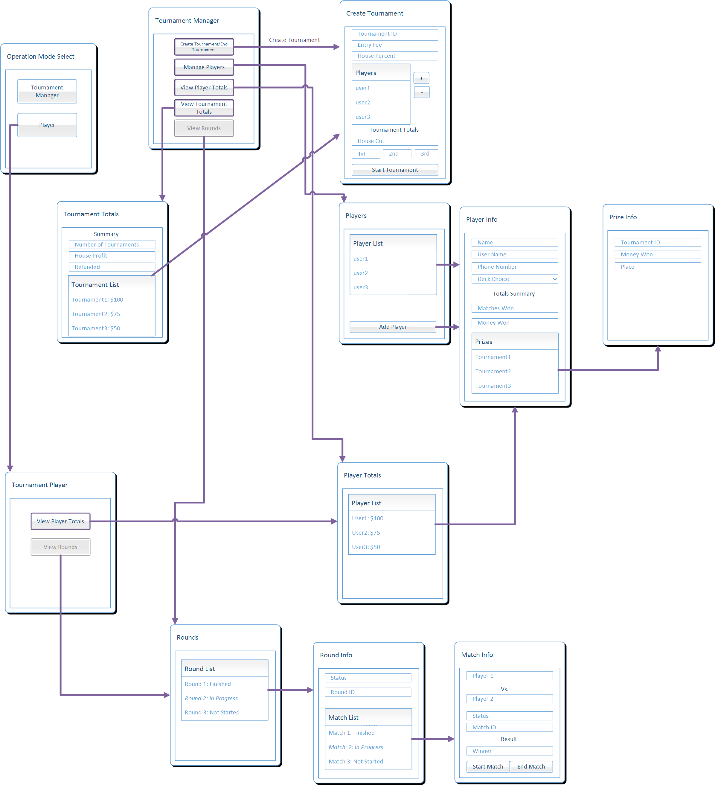

# Design Document

**Author**: Team09

## 1 Design Considerations

### 1.1 Assumptions

   The app will be developed using Android Studio version v2.1+.
   The minimum target for the Android app is API Level 19, and the maximum is API 25.
   The Android app will be tested using Android Emulator (AVD).
   The app will use the cloud hosted Google Firebase database to store the data.
   The app will not be available in Google play.
   The app will not provide Authentication support.
   Since the app uses Google Firebase database which is hosted on the cloud, the device must be connected to a internet network in order to make the database API calls. However it does provide the multi-device support. Opening the app in any device would restore the previous state of the app.
   In case of database failures because of network or the cloud service itself, the app will not provide any offline support.
   
### 1.2 Constraints

	Since the database is cloud hosted, the reliability of the database becomes paramount to the functioning of the app.
	The smooth functioning of the app on every android device cannot guaranteed since we will be testing the app on only some emulators.
	
	
### 1.3 System Environment

	The Android app is designed to be compatible with Android running mobile device which has a support for API level of 19 up to 25.
	The Android app will also be compatible with any Android mobile device emulator with the same API support level. 
	App is dependent on cloud hosted database Google Firebase.

## 2 Architectural Design

### 2.1 Component Diagram

	The Android app is simple component which has integrations with a cloud hosted database (Google Firebase). All the resources necessary for the app such as keyboard, touch capability, network are provided by the Android operating system. 
	

### 2.2 Deployment Diagram
	
	The app is packaged as a Android application and then run on a Android operation system. Since this is a very simple application, deployment diagram is not necessary.

## 3 Low-Level Design

The application design makes the database the central part of the application. The user will use the Android interface, and based on the mode of operation, will enter data into and query the database for information they wish to use. The class diagram below displays the methods used for providing an abstraction of information to and from the database.

### 3.1 Class Diagram

## 4 User Interface Design

