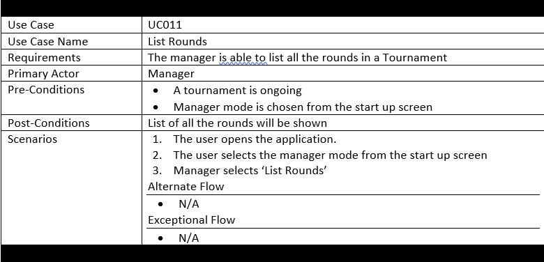
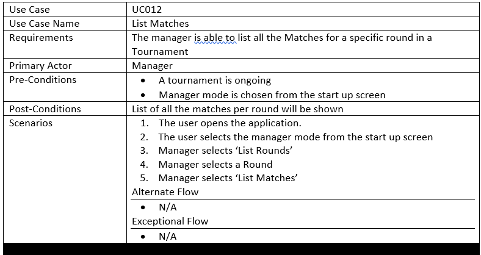

# Use Case Model

**Author**: Team09

## 1 Use Case Diagram

## 2 Use Case Descriptions

### Use Case 001

### Use Case 002

### Use Case 003

### Use Case 004

### Use Case 005

### Use Case 006

### Use Case 007

### Use Case 008

### Use Case 009

### Use Case 010

### Use Case 011

### Use Case 012

### Use Case 013

