# User Manual - Tourney Manager App

**Author**: Team 09

## Mode Selection
When opening the Tourney Manager App, the user is given the choice of which mode they wish to use. The choices are "Manager" or "Player".

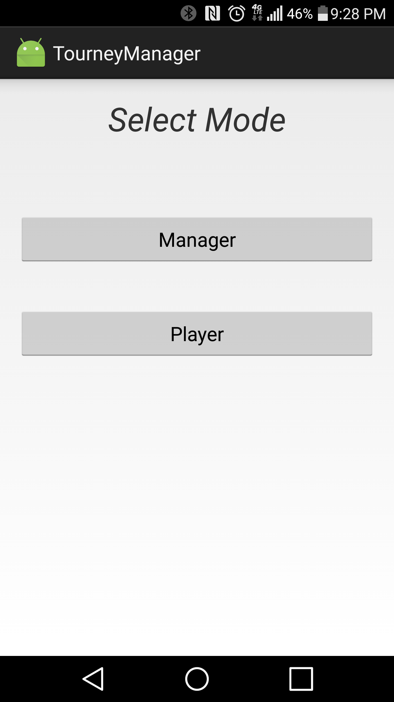

## Manager Mode
In Manager Mode, the user is able to create/start/end a tournament, manage the players in the system, view the player totals list, view the totals for completed tournaments, and start/end matches.

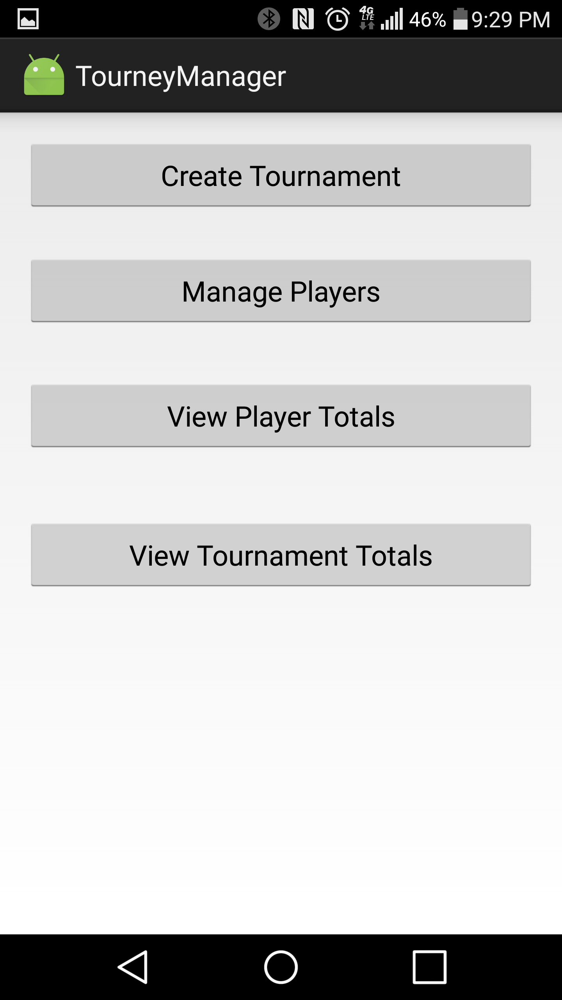

## Player Mode
In player mode, the user is able to view a list of all players totals or view the rounds for an active tournament.

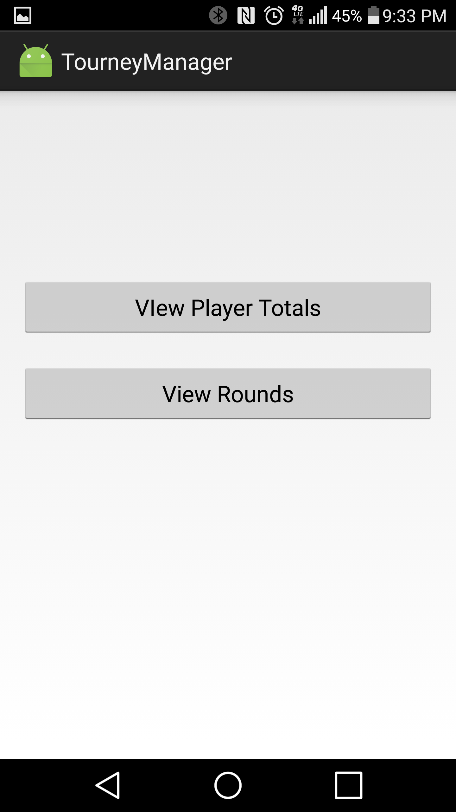

## Managaing Players
The manager is able to add/update/and remove players to/from the system. To view the list of players in the system, press the "Manage Players" button on the Manager Mode panel. The user will then be presented with the following screen.

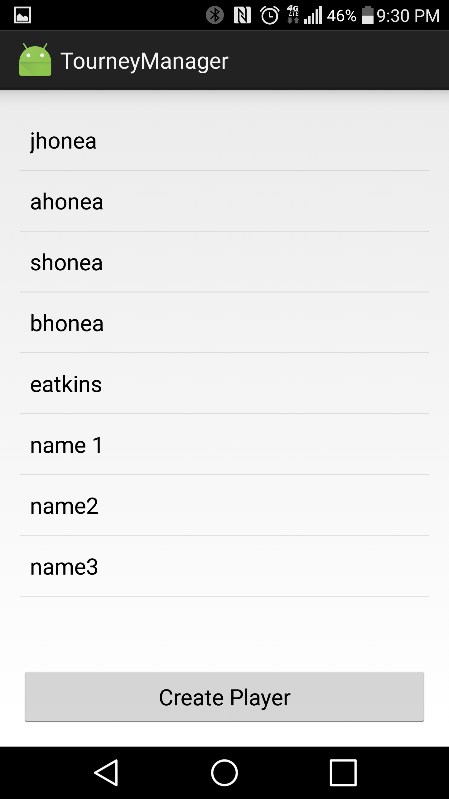

### Create Player
To create a player, press the "Create Player" button. This will bring you to a screen where you can enter the player's information. When the information is created, press the "Create Player" button.

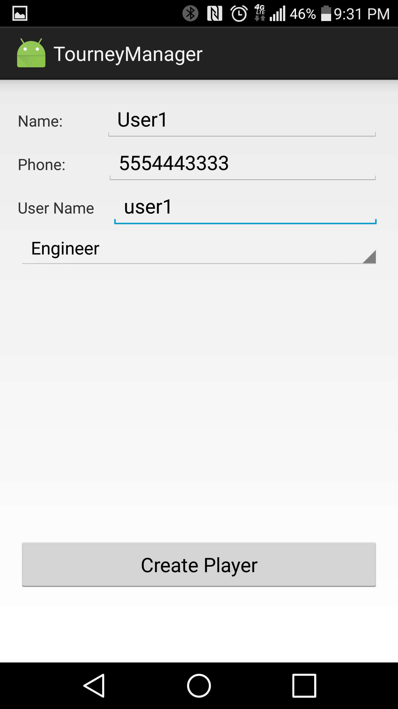

### Update or Remove Player
To update a player, click on a player displayed in the player list. This will again show you the player's information. You are able to edit any of the information except for the associated user name. To update the player, press "Update Player" button. If you wish to remove the player and all the associated plaer data, press the "Remove Player" button.

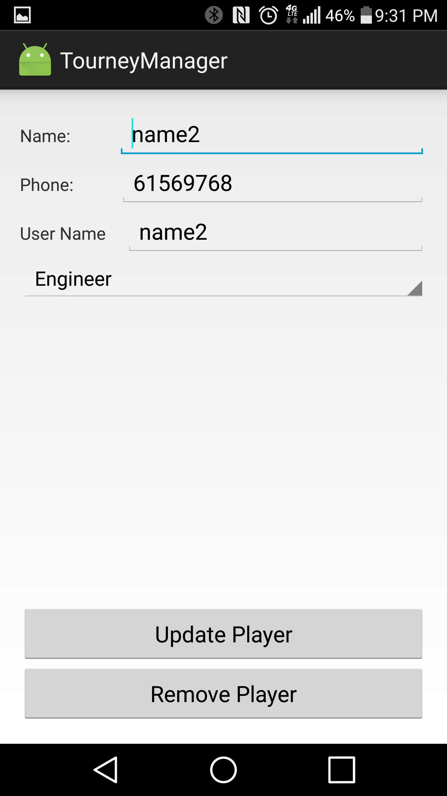

## Creating a Tournament
To Create a tournament, press the "Create Tournament" button on the Manager Mode panel. This will take you to the following screen.

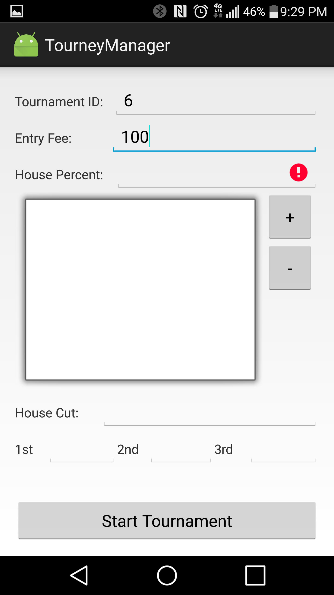

In order to create a tournament, the user must enter the per player fee, the house cut percentage, and the players involved in the tournament. The number of players in a tournament must be a power of 2 and must be greater than 3 players. To add a player, press the "+" button next to the player list. To remove a player from the list, click on the desired player and then press the "-" button. When the user adds a player, a dialog will display allowing the user to select players from the system.

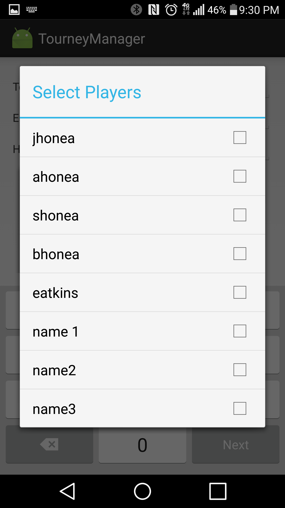

Once the user completes the adding of the required information, the calculated prize and profits information will be displayed at the bottom of the screen. 

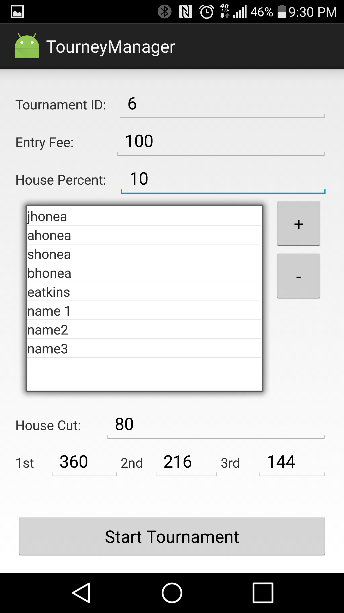

The user is then able to select "Start Tournament" to begin the tournament. If there are any errors, the app will display a Toast notification stating the error and will not allow the starting of the tournament. Once, the tournament is started, the user will be brought back to the Manager panel, which will then look like the following:

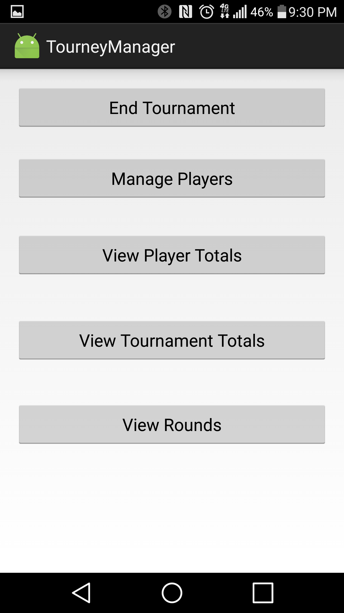

## Ending a Tournament
In order for a tournament to be ended properly, all matches must be complete. If they are not, a Toast notification will tell the user that all money has been refunded. To end a tournament, simply press the "End Tournament" button on the manager's panel.

## Rounds
When a tournament is started, all rounds are created and the matches for the first round is populated with the players in the tournament. To view the rounds, press the "View Rounds" button on the Manager's panel or the Player's panel when a tournament is active. This will display a list of all rounds in the tournament with their ID number and the status of the round. When none of the matches in the round have been started, the status displays "Not Started", when 1 or more have run the status shows "Running", and when all matches in a round have been completed the status shows "Complete". The rounds must be started in order. The app will not allow the user to start round 2 before round 1. The next round also can not start until the previous has completed.

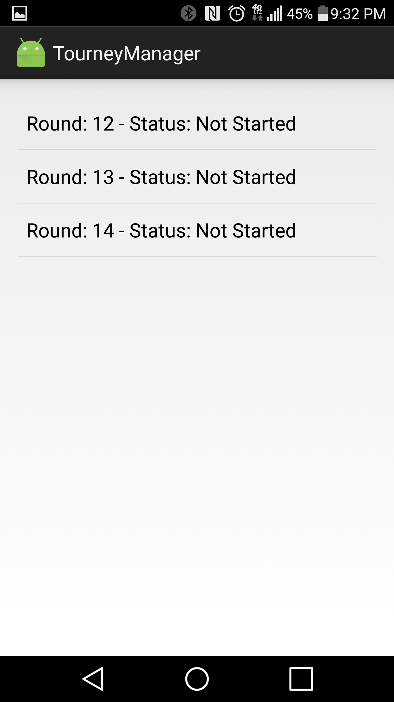

To view a round, select the round in the rounds list. This will bring the user to the Round Info page where the list of matches within the round is contained. Each match in the list should display its ID and its status: "Not Started", "Running", or "Complete".

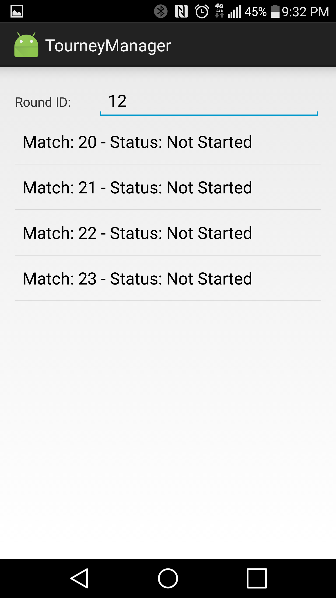

To view a match within a round, click on the match and the Match Info page will be displayed.

## Matches

The Manager is the only user able to start/End matches. When the Match Info page is displayed, it will show the information for the match: Player1, Player2, and the match ID. If a match has not been completed the winner field will not be displayed.

To start a match, press the "Start Match" button. The button will change to "End Match" and the status of the Match and the corresponding round will be updated.

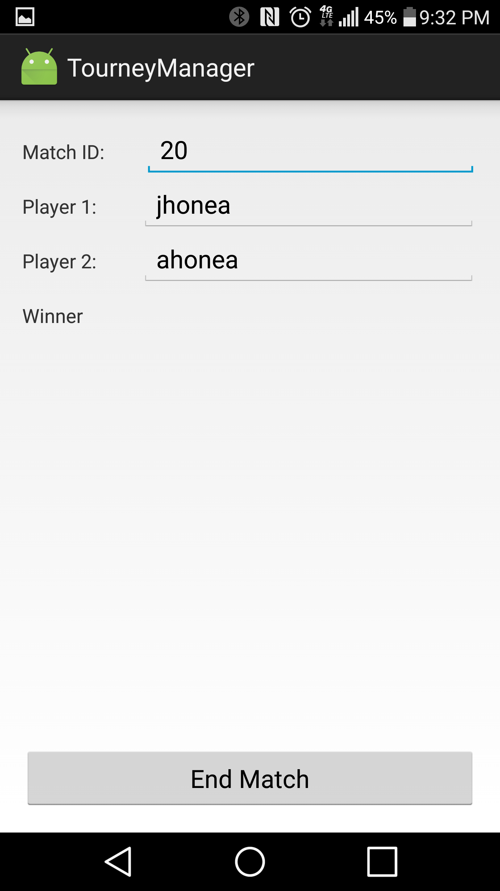

To end a match, press the "End Match" button. The manager will then be presented with a dialog asking who won the match.

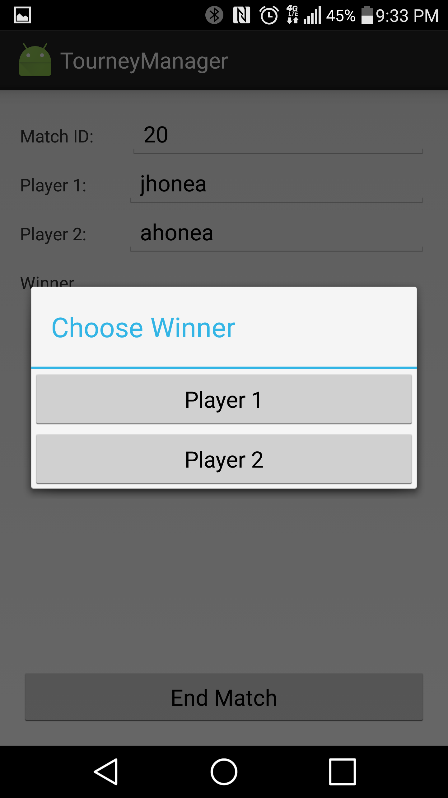

When the winner is confirmed, the match will update and the corresponding round will update.

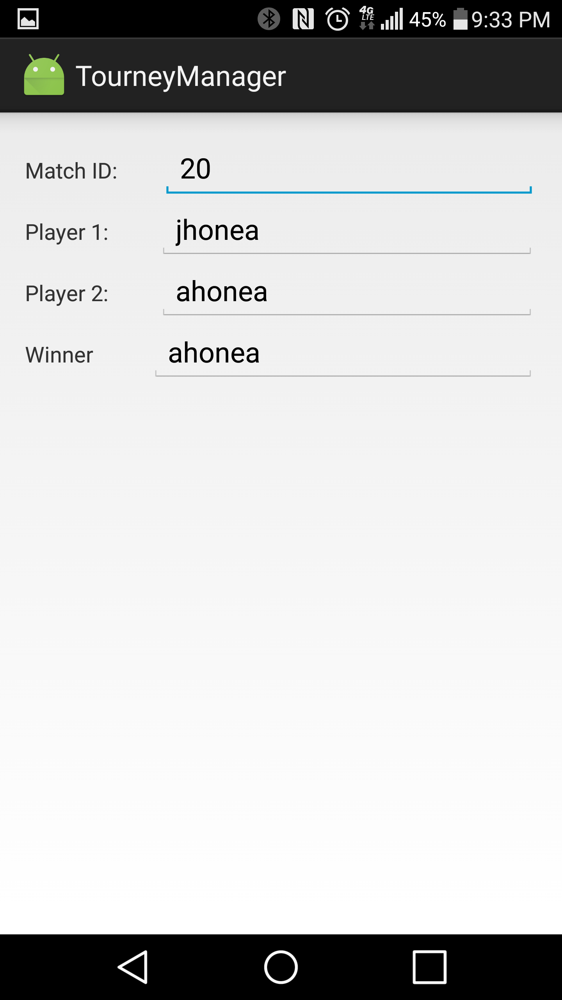

Once all matches for a round have been completed, the next round will auto-populate its matches with the remaining winning players. Once all rounds have completed, a Toast notification will display stating all matches have been completed. At this point, the manager is able to end the tournament.

## Viewing Player Totals
The manager and player are able to view a list of players sorted by their total winnings. To do this, press the "View Player Totals" button on either the Manager or Player panel. A list will be displayed as follows:

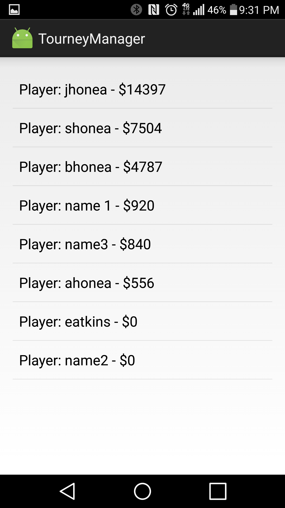

The user is then able to select a player, and it will bring them to the player information panel. The player info panel displays the player's information as well as the list of tournaments they won prizes in.

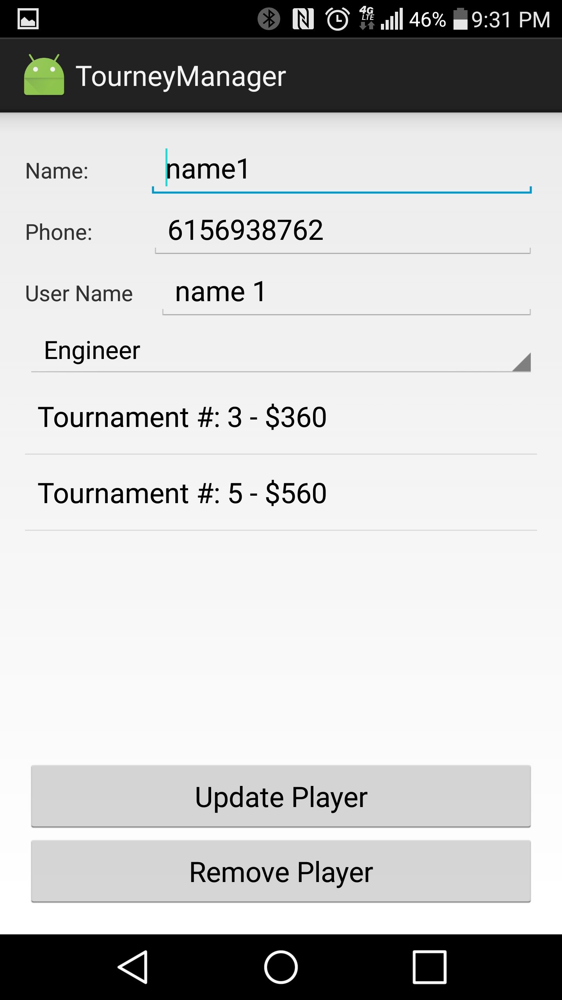

To view the information of a won prize, select the tournament, and the following information will be displayed.

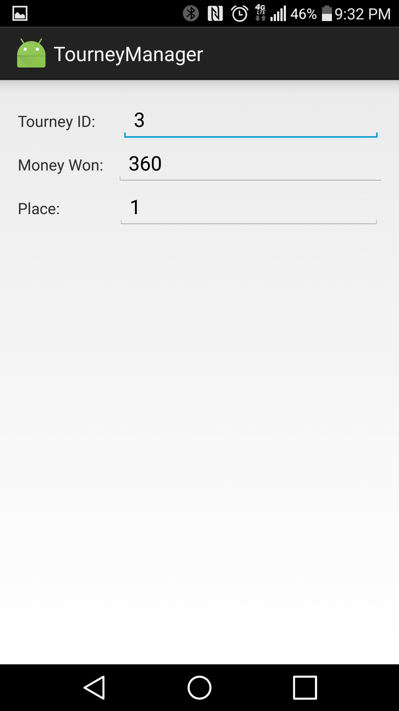

## Viewing Tournament Totals
The manager is able to view a list of completed tournaments sorted by the profit totals for the house. This screen will give the manager a total overview of profits, amount refunded, and number of tournaments completed. Each item in the tournament list will display the tournament ID, the profit amounts, and will indicate if a tournament was refunded.

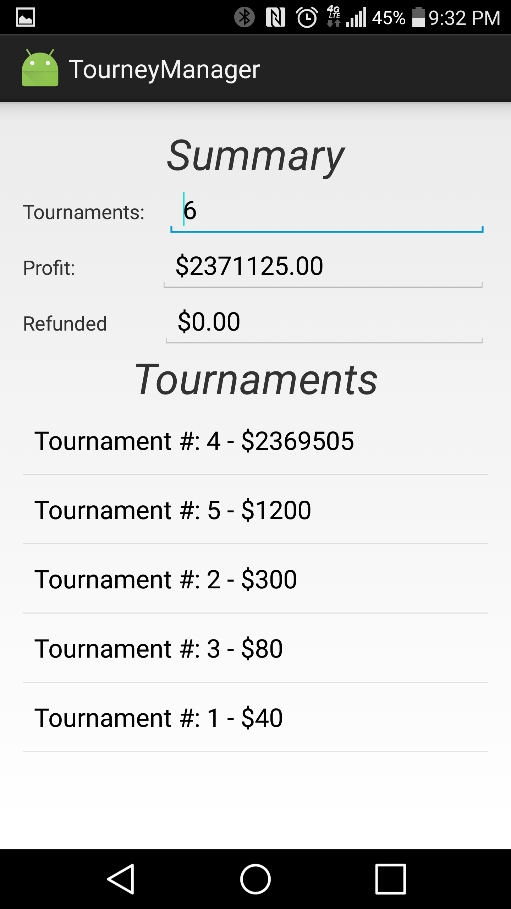

If the manager wishes to view the tournament iformation, simply select a tournament and the following information will be displayed.

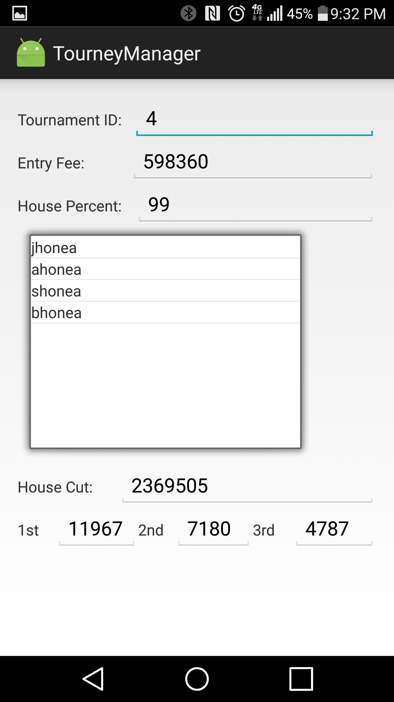

